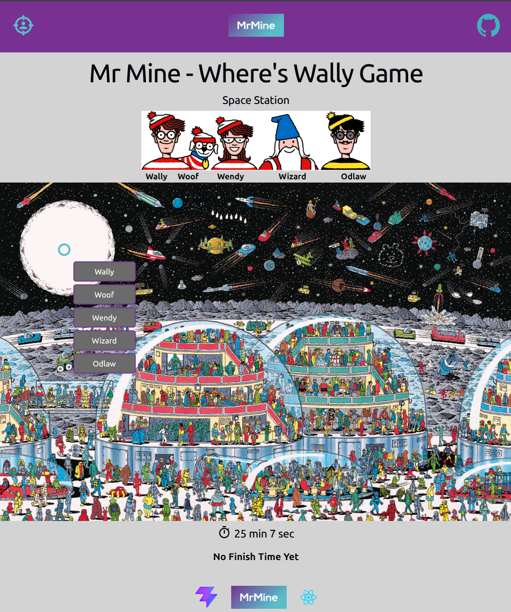

# Where's Wally - Frontend Repo (Backend is Separate)

A frontend repo for the classic Where's Wally game.

Built with React, Vite and React Router and tested using Vitest and React Testing Library.

It connects to a separate backend API repo using Node, Express, PostgreSQL and Prisma ORM.

Link here: https://github.com/Michael-Mine/odin-wheres-wally-api

This game is very similar to a photo tagging app. Players need to find the characters by clicking on the image, which places a targeting box at that location and a list of characters pops up to choose.

The selection is then sent to the REST API backend to verify if correct. There is also a timer verified on the backend with a leaderboard for the top 5 times.

Live Link on Netlify: https://mrmine-wheres-wally.netlify.app/

The API only backend is hosted on Railway.



## Tech Stack

| Layer    | Technologies                        |
| -------- | ----------------------------------- |
| Frontend | React, JavaScript, Vite, Native CSS |
| Backend  | Node, Express, JavaScript           |
| Database | PostgreSQL, Prisma ORM              |
| Testing  | Vitest, React Testing Library, Jest |

---

## System Architecture

The application is split into a 2 repos for clear separation of concerns.

- **Server**: A RESTful API focused on controller functions and middleware validation.
- **Clients**: Component-based SPAs utilizing React Router for navigation and PropTypes for type checking.

---

## Database Schema

```prisma
model Game {
  id          Int     @id @default(autoincrement())
  title       String
  characters  Character[]
  scores      Score[]
}

model Character {
  id      Int     @id @default(autoincrement())
  name    String
  xCoord  Int
  yCoord  Int

  gameId  Int
  game    Game    @relation(fields: [gameId], references: [id])
}

model Score {
  id        Int       @id @default(autoincrement())
  username  String
  time      Int       //in milliseconds
  createdAt DateTime  @default(now())

  gameId  Int
  game    Game    @relation(fields: [gameId], references: [id])
}

model Session {
  id        String  @id @default(uuid())
  gameId    Int
  startTime DateTime @default(now())
  endTime   DateTime?
}
```

---

## Local Development

### Setup

**1. Clone & Install:**

```bash
git clone https://github.com/Michael-Mine/odin-wheres-wally.git

npm install
```

**2. Environment Setup:**

Create a `.env` in root with `VITE_API_URL="http://localhost:3004/"`

**3. Run App:**

```bash
npm run dev
```

**4. Run Tests:**

```bash
npm run test
```

## Deployment on Netlify

1. Link GitHub repo

2. Check default Build command is as:

```bash
npm run dev
```

3. Check default Publish directory is as `dist`

4. Add a environment variable key: `VITE_API_URL` with value as the URL where the API is hosted e.g. on Railway.
